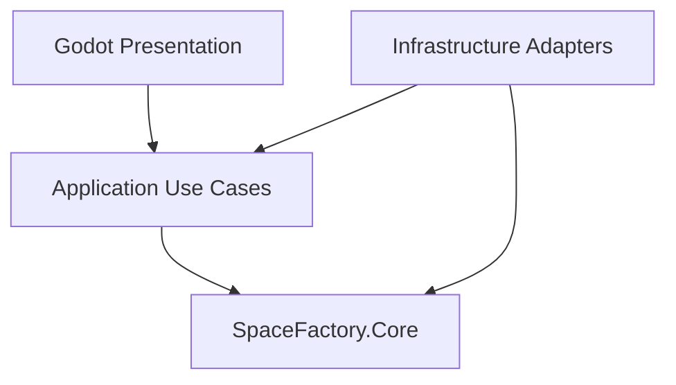
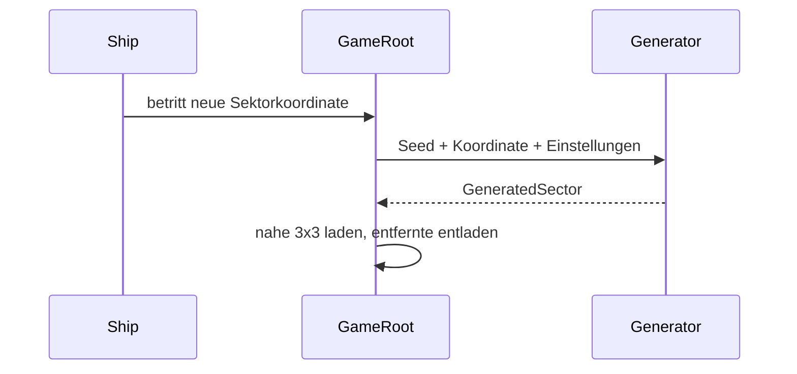

# Architektur

`SpaceFactory.Core` enthält reine C#-Domänenlogik und kennt keine Godot-Typen. Application koordiniert künftig Laden, Landen, Transfers, Bauen und Speichern. Infrastructure übernimmt JSON, Dateizugriffe, Persistenz und Generatoradapter. Presentation enthält Nodes, Szenen, Eingabe, Kamera und UI. Abhängigkeiten zeigen nach innen zum Core.

Weltänderungen werden künftig als Deltas über der aus dem Seed rekonstruierten Grundwelt gespeichert. Schiffsteuerung und spätere On-Foot-Steuerung werden getrennte Zustände/Komponenten. Fabrikmodelle, Rezepte und Energie gehören in den Core; Godot-Nodes visualisieren sie lediglich.
