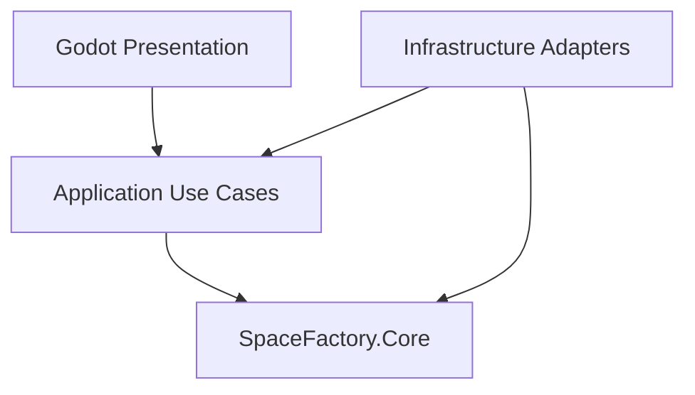
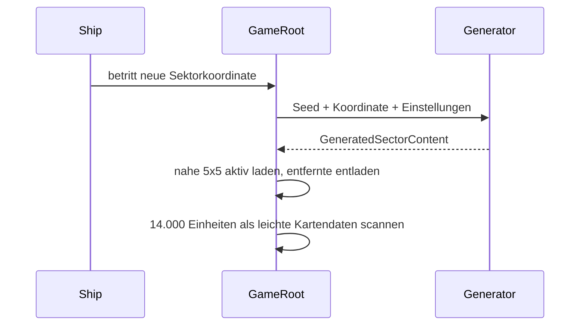

# Architektur

`SpaceFactory.Core` enthält reine C#-Domänenlogik und kennt keine Godot-Typen. Application koordiniert künftig Laden, Landen, Transfers, Bauen und Speichern. Infrastructure übernimmt JSON, Dateizugriffe, Persistenz und Generatoradapter. Presentation enthält Nodes, Szenen, Eingabe, Kamera und UI. Abhängigkeiten zeigen nach innen zum Core.

Weltänderungen werden als Deltas über der aus dem Seed rekonstruierten Grundwelt gespeichert. Schiff- und On-Foot-Steuerung bleiben getrennte Zustände. Fabrikmodelle, Rezepte, Inventartransaktionen, Energie, Forschung und Treibstoff liegen im Godot-unabhängigen Core. `FactoryRuntimeController` aktiviert davon nur die aktuell geladenen Kometennetze; `MachineView` und die Menüs visualisieren den Zustand. Der versionierte Infrastructure-Adapter speichert Maschinen-, Forschungs- und Tank-Snapshots unter `user://factory_state.json`.
